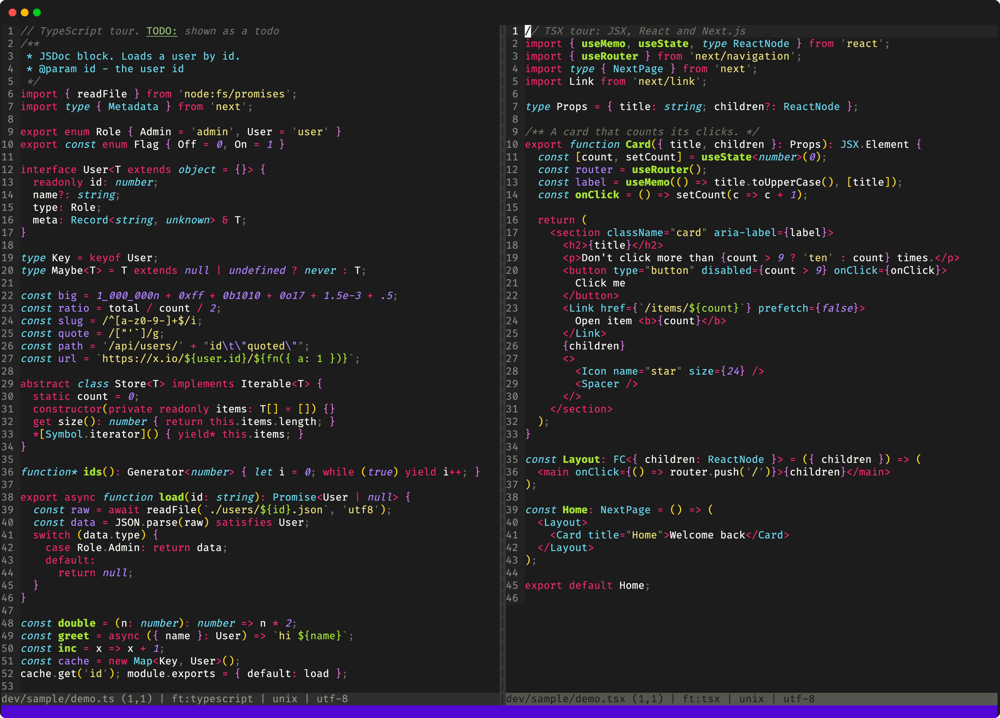
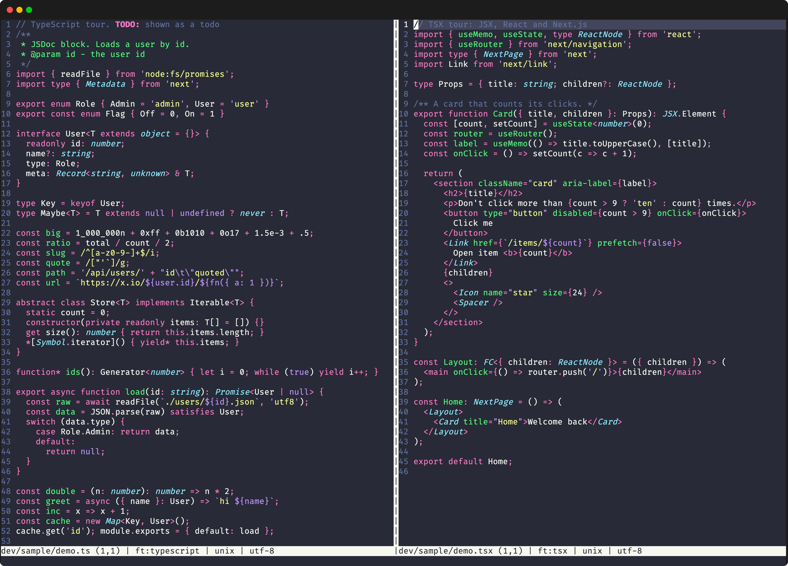
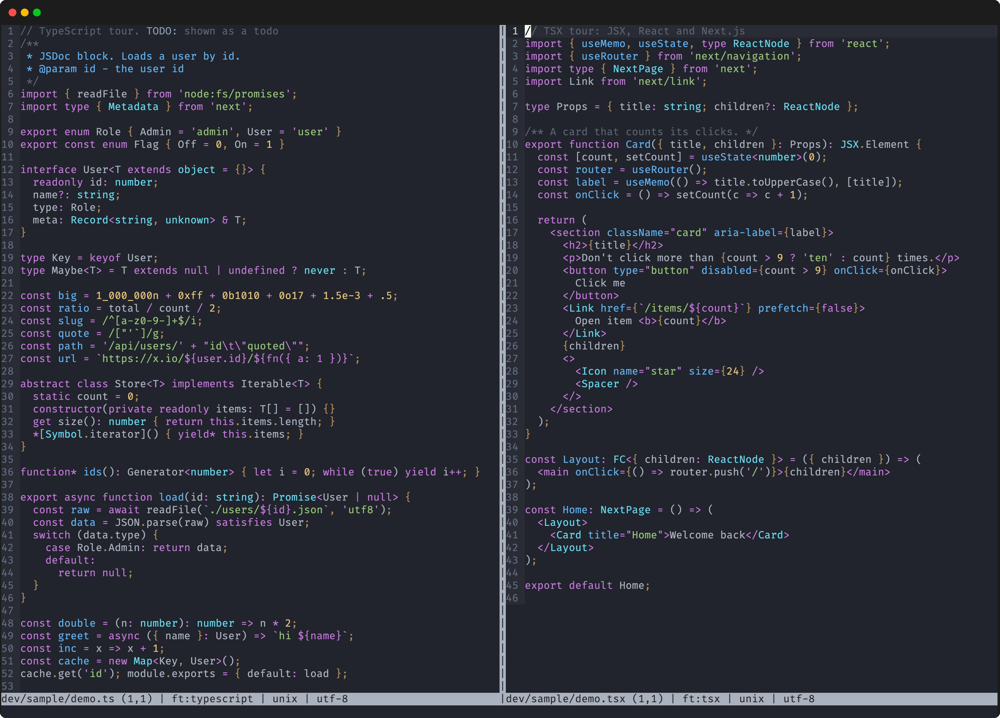
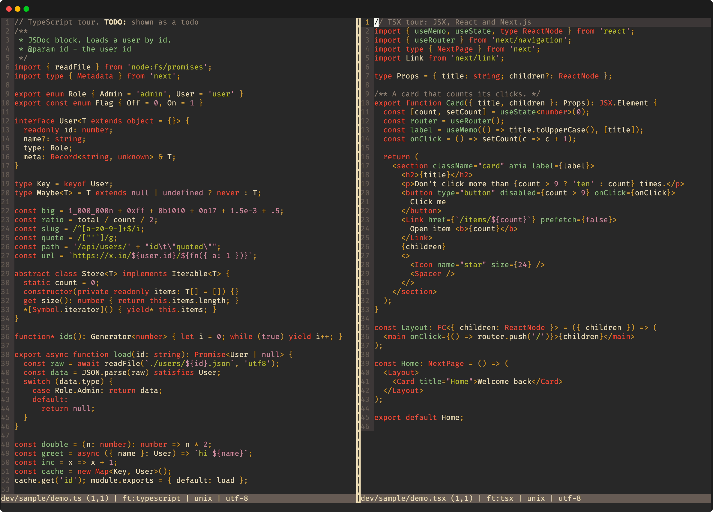
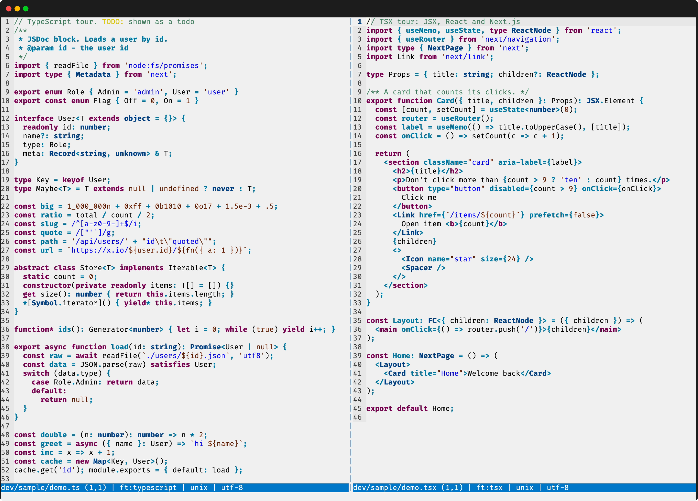

# TypeScript for micro

Syntax highlighting for TypeScript and TSX in the
[micro](https://micro-editor.github.io/) text editor, with JSX, React and
Next.js support.



<details>
<summary>More colour schemes</summary>

Dracula:



One Dark:



Gruvbox:



Duke Light:



</details>

The syntax files apply to these files:

- `.ts`, `.mts` and `.cts` files.
- `.tsx` files, which also contain JSX.

The syntax files also identify common React and Next.js types, for example
`ReactNode`, `FC` and `NextPage`. They also identify React hooks, for example
`useState` and `useRouter`.

## Install

This repository is a micro plugin. To install it, clone it into the micro
plugin directory:

```sh
git clone https://github.com/jv-k/micro-typescript-syntax \
  "${MICRO_CONFIG_HOME:-${XDG_CONFIG_HOME:-$HOME/.config}/micro}/plug/typescript_syntax"
```

Then restart micro.

### Update

To update the plugin, pull the latest version into the plugin directory:

```sh
git -C "${MICRO_CONFIG_HOME:-${XDG_CONFIG_HOME:-$HOME/.config}/micro}/plug/typescript_syntax" pull
```

Then restart micro.

### Reload

The micro `reload` command does not load plugins again. After a `reload`,
restart micro to get the colours back.

## Install with an agent

To let a coding agent install the plugin, give it this prompt. To update an
existing install, give the agent the same prompt again.

```text
Install the micro-typescript-syntax plugin for the micro text editor.

1. Make sure that micro is installed. If it is not installed, stop and tell me.
2. Find the micro configuration directory. Use $MICRO_CONFIG_HOME if it is
   set. If not, use $XDG_CONFIG_HOME/micro. If neither is set, use
   ~/.config/micro.
3. Look for the directory plug/typescript_syntax in the configuration
   directory. If it exists and is a clone of
   https://github.com/jv-k/micro-typescript-syntax, do a git pull in it.
   If it exists and is not that clone, stop and tell me.
4. If the directory does not exist, clone
   https://github.com/jv-k/micro-typescript-syntax into it.
5. Look in the syntax subdirectory of the configuration directory for
   typescript.yaml, typescript-rules.yaml, tsx.yaml and jsx-tags.yaml.
   Micro uses these files before the plugin. Do not change or delete them. Tell me which of them
   exist and where they point if they are links.
6. Tell me the plugin path and the installed commit. Tell me to restart
   micro.
```

## Colour scheme

This plugin works with any micro colour scheme. It assigns detailed colour
groups to TypeScript and TSX syntax. If the active scheme does not define a
detailed group, micro uses the nearest parent group instead.

For example, `identifier.function.hook` falls back to
`identifier.function`, then to `identifier`. This means that React hooks still
have a colour in existing schemes, while schemes such as
[mojokai](https://github.com/jv-k/micro-mojokai-colorscheme) can give them a
distinct colour.

Some notable groups are:

| Syntax | Group | Fallback |
|---|---|---|
| Regular expression literals | `constant.string.regex` | `constant.string`, then `constant` |
| JSX elements, for example `<div>` | `statement.tag` | `statement` |
| JSX components, for example `<Layout>` | `type.tag` | `type` |
| JSX attributes | `identifier.attribute` | `identifier` |
| React hooks | `identifier.function.hook` | `identifier.function`, then `identifier` |

## Edge cases

Micro highlights one line at a time with Go regular expressions, so a few cases
use approximate rules:

- A regular expression directly after `)` or `]` has no colour, for example
  `if (ok) /re/.test(s)`.
- A regular expression with an unescaped `>` outside `[…]` has no colour.
- Arrow function names have no colour when a parameter contains parentheses or a
  string, for example `(a = f()) =>`.
- In a ternary that ends in an arrow function, such as `ok ? a : (b) => b`, `a`
  has the function name colour.
- A type annotation has no type colour when it is on a line of its own and ends
  in a comma, for example a parameter `token: Kind,`: an object key reads the
  same.
- The types of an arrow function that has a name, such as
  `const f = (a: A): B =>`, have no colour.
- A union or intersection member on a line of its own has no type colour. A
  line such as `| A` or `& B` is indistinguishable from a bitwise expression.
- In JSX text, keywords such as `for` and `in` have the keyword colour.
- A JSX tag directly after a word, such as `text<b>`, has no tag colour.
- A JSX attribute without a value, such as `download`, has no attribute colour
  when it follows an attribute with a string value or is on a line of its own.
- `${…}` handles one level of nested braces.
- A `${…}` that spans lines, or that holds another template literal, does not
  get the interpolation colour. A fix needs nested regions, which micro
  highlights incorrectly until
  [micro#4022](https://github.com/micro-editor/micro/pull/4022).
- A `default:` switch label followed by trailing spaces has no keyword colour.
- Micro versions without [micro#4022](https://github.com/micro-editor/micro/pull/4022)
  can drop the escape colours in some strings.

## Contributing

To change the rules, update the screenshots, or make a release, refer to
[CONTRIBUTING.md](CONTRIBUTING.md).

## License

[ISC](LICENSE)
